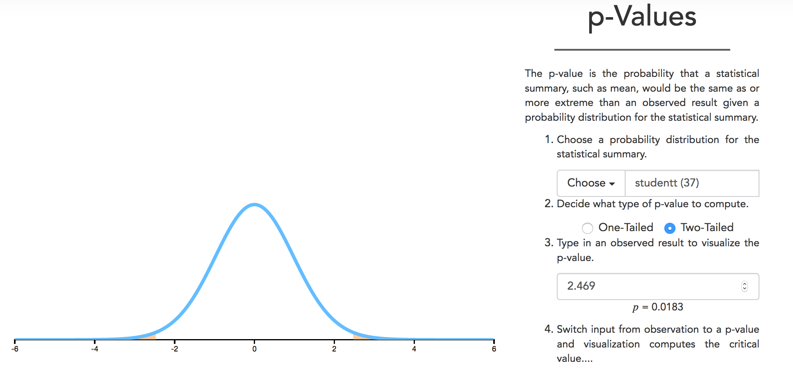

<!-- Run line below in R to render multiple documents: -->
<!-- rmarkdown::render(here::here("bioc461-lec1.Rmd"), output_format='github_document') -->

<style>
  .col2 {
    columns: 2 200px;         /* number of columns and width in pixels*/
    -webkit-columns: 2 200px; /* chrome, safari */
    -moz-columns: 2 200px;    /* firefox */
  }
  .col3 {
    columns: 3 100px;
    -webkit-columns: 3 100px;
    -moz-columns: 3 100px;
  }
</style>

<style type="text/css">
.table {
    width: 60%;
}
</style>

<!-- this puts \sf in front of every latex equation, to generate -->
<!-- sans-serif text, but I'm not using it here :) -->
<!--
<script type="text/x-mathjax-config">
MathJax.Hub.Register.StartupHook("TeX Jax Ready",function () {
  var TEX = MathJax.InputJax.TeX;
  var PREFILTER = TEX.prefilterMath;
  TEX.Augment({
    prefilterMath: function (math,displaymode,script) {
      return PREFILTER.call(TEX,"\\\sf{"+math+"}",displaymode,script);
    }
  });
});
</script>
--> 

## What’s so great about statistics?

 - In science we spend much of our time generating experimental data.
 - We use this data both to answer our scientific questions, and to formulate new hypotheses.
 - Rigorous analysis and interpretation of data is a vital component of science.
 - Statistics provides a collection of tools to help us answer questions

## Introducing RStudio

The free RStudio application provides an "integrated development environment" (IDE) for working in R.

<center></center>

https://www.rstudio.com/


## What does it look like?

<center></center>


## Getting started with R

 - Open RStudio and spend some time getting familiar with the layout:
      - Console: type commands here
      - Source: save your code here
      - Environment/History: session info
      - Files/Plots/Packages/Help/Viewer: everything else  :)
 - You can write commands/code in the source pane, and then "submit" it (i.e., run it)
 in the console by hitting `Ctrl+Enter` (Windows) or `Cmd+Enter` (Mac)
 - Comments start with `#` and are ignored by R


## Getting started with R

```{r}
# This is a comment

# This adds 3 + 5
3 + 5

# This adds 3 + 2 and assigns it to an object called "a"
a = 3 + 2

# This shows the value of "a"
a
```


## Getting started with R

```{r}
# This also adds 3 + 2 and assigns it to an object called "a"
a = 3 + 5

# This takes the object "a", and adds 10 to it
a + 10

# This calculates the square root of "a"
# sqrt is called a "function" - we'll use functions a lot
sqrt(a)
```

## Lets do something useful

 - While it is fun to use R as a giant calculator, that's not going to help (much) with your research.
 - We want to do some data analysis in R
      - First, we need data
      - Good, clean, well-organised data


## Data organization

 - A spreadsheet application (e.g., Microsoft Excel) is often used to “organize” data.
    - Excel has the ability to make raw data look very pretty.
    - Statistics applications (e.g., SPSS, R, SAS, Prism) often have trouble reading in the pretty data.
 - Try to keep it simple:
    - Samples in rows, variables in columns
    - No blank cells or rows (unless data are missing)

## Example data: 

<center></center>

<BR>
Note the lack of units in the Weight Gain column – stats 
programs expect numeric values for continuous data.

## Getting some data

 - Download some small example data sets:
   https://github.com/mikblack/BIOC461-stats/blob/master/DataSets.zip?raw=true
 - Download the file, unzip it, and move the contents to where you would like to save your work.
 - For example, create a folder on your desktop called `BIOC461`, and move the `DataSets` folder there.
 - The `DataSets` folder should contain five files:
    - calcium.csv
    - corn.csv
    - morphine.csv
    - mouseExample.csv
    - pigs.csv

## In RStudio - "start a project"

 - Choose `New Project...` from the `File` menu (or from the `Project` pulldown at the top right of the RStudio window).
 - Select `Existing Directory` and then browse to your BIOC461 folder (e.g., on the desktop) - click on the folder to highlight it, and then click `Open`.
 - The `Project Working Directory` should now show the path to your `BIOC461` folder - if not, lcik `Browse` again and fix it, otherwise
 click `Create Project`.
 - RStudio will now resart, and the `Files` pane should be displaying the contents your `BIOC461` folder.
 - Now select `New File` and then `R Script` from the `File` menu - this is where we will save the commands we use for our data analysis.


## Loading the data
    
```{r}
## Load the data into R from a CSV file
mouseData = read.csv('DataSets/mouseExample.csv')
```

```{r}
## what sort of data object is it?
class(mouseData)
```

```{r}
## What are its dimensions?
dim(mouseData)
```


  
## Variable names
  
  
```{r, echo=FALSE}
options(width = 70)
```
  
```{r}
## List the variables names in the dataframe
names(mouseData)
```


  
## Inspecting the data
  
```{r}
## Typing the name of the object displays its contents
mouseData
```

```{r, eval=FALSE}
## Open the built-in RStudio viewer:
View(mouseData)
```

## Accessing individual variables
  
```{r}
## The $ symbol allows you to reference the columns of a dataframe.
## The following produces a summary of the data in the 
## "WeightGain_grams" column, and the calculates the standard 
## deviation.
summary(mouseData$WeightGain_grams)
sd(mouseData$WeightGain_grams)
```


## Accessing individual variables

```{r}
## You can also just use the column number
summary(mouseData[,4])
```

```{r}
## Or the name of the column
summary(mouseData[,"WeightGain_grams"])
```

## Summarizing data

- Frequency Distribution: display the number of times each value occurs in the data set
 - Example (for discrete quantitative data)
    - Size of litters for n=36 sows
    - Litter size (number of piglets) is an integer (discrete)

```{r}
pigs = read.csv('DataSets/pigs.csv')
head(pigs)
```

## Frequency tables and histograms

- Summarize with a frequency distribution (as a table):

```{r}
## Since there is only one variable, can just specificy the 
## "pigs" data.frame
table(pigs)
## Better practice to specify the variable you are interested in
table(pigs$Weight)
```

## Frequency tables and histograms

- Generate a frequency histogram:

```{r, fig.height=4, fig.width=5}
hist(pigs$Weight)
```

## Example: heroin data
 - A pathologist measures the amount of free morphine concentrations (ng/mL) in blood taken from 25 “acute” heroin overdose victims. The data are listed below:

```
       67  110	 45	  96   80  103  223   86   58
      112   52  165	  91  189   85  150  120  293
      153  390	 47	 158   77  216  526		
```


 - Source: B Levine, D Green–Johnson, KA Moore, D Fowler, A Jenkins, (2001). Assessment of the acuteness of heroin deaths from the analysis of multiple blood specimens. Science and Justice 42(1). 17-20.


## Heroin data (ordered)

```{r,eval=FALSE}
heroin = read.csv('DataSets/morphine.csv')
sort(heroin$Morphine)
```

```{r,echo=FALSE}
heroin = read.csv('DataSets/morphine.csv')
options(width=50)
sort(heroin$Morphine)
```

 - Easy to see minimum and maximum
 - What is a typical value?
 - How variable are the data?
 - Any clusters in the data?
 - Any outliers?  

## Data visualization - dotplots

 - A dotplot provides a simple 1-D representation of a quantitative variable.
    - Each dot represents one observation.
    - Provides instant visual summary of the data.

```{r, fig.height=2.5, fig.width=6}
stripchart(heroin$Morphine, pch=16, vertical=FALSE)
```

## Describing distributions
 - The shape of a histogram can be described by a smooth curve that roughly follows the tops of the bars.
 - This can be done by eye or by numerical algorithms on the computer.  
 - The shape often follows certain patterns:
    - symmetric (same right to left)
    - bell-shaped
    - skewed to the right or left
    - unimodal (one major peak)
    - bimodal (two major peaks)
    - spread (wide or narrow)

## Summarizing quantitative data
 - Describe the distribution of a collection of data
 - Measures of centre or location
   - Means or medians
 - Measures of spread or scale
   - Standard deviations, variances, ranges, and interquartile ranges

## Measuring the centre
 - Average or sample mean
 - The mean is _"the sum of all the observations divided by the number of observations"_
 - In R:
```{r}
mean(heroin$Morphine)
```

## Measuring the centre
 - The sample median is the middle value when the observations are ordered.
 - Rule
    - If you have an odd number of observations, then the median is the middle value.
    - If you have an even number, the median is the average of the two middle observations.
 - In R:
```{r}
median(heroin$Morphine)
```

## Which one should we use?
 - Mean
    - The “balance point” of the histogram
    - Affected by outliers (e.g., heroin data)
    - Most commonly used in testing and estimation
 - Median
    - Divides the area of the histogram in half
    - Unaffected by a few outliers
 - If the histogram is fairly symmetric, the mean and median will be similar.

## Five number summary
 - When the data are ordered
    - LQ is ¼ of the way in from the bottom
    - UQ is ¼ of the way from the top

```{r}
summary(heroin$Morphine)
```

## Visualization: boxplots

- Boxplots provide another method for summarizing a quantitative variable.
    - Box contains central 50% of data (between LQ and UQ). 
    - Median is line across box.
- Software packages differ in calculation of “whisker length”.

```{r,fig.width=8,fig.height=2.5}
boxplot(heroin$Morphine, horizontal = TRUE)
```

## Measures of Dispersion
 - There are several ways to describe the variability or spread of a data set: 
    - Range 
    - Interquartile range 
    - Standard deviation
    - Variance
 - Standard deviation is the most common.

## Ranges
 - The Sample Range: difference between the largest and smallest observation.  
    - Advantage:  easy to calculate. 
    - Disadvantages:  highly sensitive; not useful for testing
 - The Interquartile Range (IQR):  difference between the first and third quartiles: IQR = Q3 – Q1.

```{r}
range(heroin$Morphine)
IQR(heroin$Morphine)
```

## Sample Standard Deviation 
 - Measures how far away, on average, values are from the center
 - Same units as the data
 - s=0 only when there is no spread, otherwise s>0.

```{r}
sd(heroin$Morphine)
```
 
 
## The Sample Variance
 - The sample variance is just the square of the sample standard deviation.  Its symbol is s$^2$.
 - “Average squared distance from the mean.”
 - Units are the square of the data units.

```{r}
var(heroin$Morphine)
sd(heroin$Morphine)^2
```

## Summary - describing “spread”
 - Range = maximum – minimum
 - Not sensible – affected severely by outliers
 - Interquartile range = UQ – LQ
 - Describes the central half (50%) of the data
 - Sample standard deviation (s.d.) = “square root of the averaged squared distance to the mean”

## Estimation - reporting uncertainty

 - Once we have gathered/generated/downloaded some data, we often want to estimate some quantity that is of interest:
    - e.g., the mean of the population from which our sample was taken
 - We can do this by using the concept of the *confidence interval*
    - uses quantities calculated from the data to obtain population-level estimates 
    - report the *point estimate* (i.e., a single number), along with an estimate of our uncertainty

## The Normal Distribution
 - Describes a wide variety of data very well
    - e.g., measurement error, height, body temperature, levels in blood samples (e.g. cholesterol) 
 - Characterized by the (population) mean, $\mu$ (defines centre) and the (population) SD $\sigma$ 
 (defines spread).
 - 68% of distribution is between -$\sigma$ and +$\sigma$, 95% between -2$\sigma$
 and +2$\sigma$ (actually 1.96) and 99.7% between -3$\sigma$ and +3$\sigma$.

 
```{r,echo=FALSE,fig.height=2.5,fig.width=6}
x = seq(-3.5,3.5,l=100)
par(mar=c(5,4.1,1,4.1))
plot(x, dnorm(x),type='l',ylab='Density',xlab='')
```

<!-- ## The Normal Distribution -->
<!--  - It can be proved mathematically that any random variable that is the sum or average of many small independent effects will have a distribution of values that is close to normal. -->
<!--  - Examples: -->
<!--     - measurement error -->
<!--     - test scores -->
<!--     - height, yield -->
<!--     - body temperatures -->
<!--     - levels in blood samples (e.g. cholesterol) -->

<!-- ## Normal curves -->
<!--  - “Normal” distribution refers to a family of curves.   -->
<!--  - Characterized by the (population) mean, $\mu$  and the (population) SD $\sigma$. -->
<!--  - Roughly 68% of distribution lies between -$\sigma$ and +$\sigma$, 95% between -2$\sigma$ -->
<!--  and +2$\sigma$ (actually 1.96) and 99.7% between -3$\sigma$ and +3$\sigma$. -->

## Sampling Distributions
 - Start with population with a certain distribution (e.g., normal, but doesn’t have to be).
 - True mean $\mu$ and SD $\sigma$ (parameters describing distribution)
 - Take sample of size $n$ from normal population
    - Get sample $y_1,...,y_n$ 
    - Calculate mean, $\bar{y}$ and sample SD $s$ (estimates for parameters).
 - Close(ish) to $\mu$ and $\sigma$, especially if $n$ is large.  
 - What if we drew a different sample? Wouldn’t get same $\bar{y}$ and $s$, since sample would be different
 - Sampling variability: how does taking different samples affect our estimates of $\mu$, and $\sigma$?
    
## Meta-experiment
 - Think about repeating experiment many times (taking one sample of $n$ is one repetition).
 - Think of the probability distribution of all the possible outcomes for the estimates $\bar{y}$, $s$.
 - This is called a sampling distribution for the parameter estimates (here $\bar{y}$, $s$).
 - Usually can’t actually generate the sampling distribution: can only do sampling once
 - Sampling distribution represents a conceptual _meta-experiment_.

<!-- ## Sampling Distribution: Normal Mean -->
<!--  - Sample of size $n$ from a normally distributed population  -->
<!--  - Observe sample mean $\bar{y}$. -->
<!--  - How close is this likely to be to $\mu$?  -->
<!--  - Meta experiment: Look at the _sampling distribution_ for $\bar{y}$.   -->
<!--     - New “sample size” is number of  times we repeat experiment  -->
<!--     - New observations are the $\bar{y}$’s.   -->
<!--     - Draw a histogram of those observed $\bar{y}$’s.  -->

## Visualising the "meta-experiment"

 - Go to the website below, click on "Chapters" (next to "Home" at the top left 
 of the screen) and select "Probability Distributions" and then "Central Limit 
 Theorem":
 
    http://students.brown.edu/seeing-theory/index.html
 
 - Set the parameters to $\alpha=5$ and $\beta=5$, with a sample size of 10 (technically not a normal distribution, but close enough for our purposes).
 - Generate draws from this distribution, and observe the shape of the resulting distribution of the means (each "draw" generates 10 obervations, and takes the mean: the distribution of means is plotted in the lower graph).
 - The shape should be suspiciously familiar...

## Visualising the "meta-experiment"

<center></center>

http://students.brown.edu/seeing-theory/index.html

## Sampling Distribution: Normal Mean
 - _What does it look like?_
    - it looks like a normal curve
    - it has same mean as the original distribution: $\mu$.  
    - it has less variability: the SD is smaller.  
    - This is because some of the “noise” in the 
    individual observations is smoothed out in the $\bar{y}$’s.  
    - new distribution has SD = $\sigma/\sqrt{n}$.

## Central Limit Theorem
 - Even if Y doesn’t have a normal distribution, the sampling distribution of $\bar{y}$ will be close to normal, when $n$ is large. 
    - It also has mean $\mu$ and SD equal to $\sigma/\sqrt{n}$
 - What does “large” mean in this theorem?  
 - It depends how close to normal the distribution of Y is.
    - If Y is normally distributed, then $n$=1 is big enough.
    - If Y is not normally distributed, but is fairly symmetric and fairly bell-shaped, then n doesn’t have to be too large (e.g., $n$=10).
    - If the distribution of Y is really weird-looking, then $n$ may have to be really big.

## Visualising the Central Limit Theorem

<center></center>

http://students.brown.edu/seeing-theory/index.html

<!-- ## Rationale for SD=$\sigma/\sqrt{n}$ -->
<!--  - If $n$ is large, then $\bar{y}$ will be a pretty good estimate of $\mu$, so there should be less variability in its SD, but if $n$ is small then $\bar{y}$ will be more variable.  -->
<!--  - The actual square root order of the correction is a probabilistic effect related to the arithmetic of adding variances.  -->
<!--  - The CLT applies to the above discussion on estimating means.  So, even if data are not strictly normal, this method gives a good approximation to the distribution for the mean, $\bar{y}$. -->

## Estimation
 - Usually do not know the true $\mu$ and $\sigma$.
 - Want to estimate $\mu$ with $\bar{y}$ and also have some idea how good our estimate is.
 - Want to make an interval around $\bar{y}$ that we are, say, 95% certain contains the true value of $\mu$.
    - called a 95% confidence interval
 - In general we want to find a "1-$\alpha$" confidence interval 
    - For a 95% CI, have  = 0.05; for a 90% CI have  = 0.10, 
    for a 99% CI have  = 0.01, etc

## Estimation (continued)
 - We do the best we can: must estimate $\sigma$ with $s$.  
 - Define the _standard error of the mean_ as 
 SE = $s/\sqrt{n}$.  
 - SE is an estimate of the true standard deviation of the mean, which is $\sigma/\sqrt{n}$.
    - Will use the estimate SE in place of the true value .
 - There is a price to pay for not using the true value: can’t use normal distribution for our calculations.
    - Using estimate for  introduces extra uncertainty.
    - Makes the confidence interval wider.

## The t distribution
 - Use a distribution with a little more variability than the normal distribution: the _t-distribution_
    <!-- - a family of probability distributions for continuous variables -->
    - shape similar to the standard normal N(0,1) but kind of squashed so that it has a wider spread
    - always centered at mean 0, with amount of squashing determined by the "degrees of freedom" (df).
 <!-- - Call the random variable $T$ and the observed values $t$. -->

<!-- ## The t distribution -->

```{r, echo=FALSE, fig.height=2.5, fig.width=6}
x = seq(-5,5,l=100)
d = c(1,2,5,10,20)
par(mar=c(0.2,4.1,0,4.1))
plot(x, dt(x,1),type='l',ylab='Density',xlab='',ylim=c(0,0.4),xlim=c(-4,4))
for(i in 2:5) lines(x, dt(x,d[i]),col=i)
lines(x,dnorm(x),col=6)
legend("topright",legend=c(d,"z"),fill=1:6,title='df')
```

<!-- - At df=1 the t distribution has "heavy tails". -->
<!-- - Tails "lighten" as df increases (mass moves to centre). -->
<!-- - As df$\to\infty$, the t-distribution converges to the normal (z). -->

<!-- ## t distribution for confidence intervals -->
<!--  - Because we are using SE instead of $\sigma/\sqrt{n}$, we have more uncertainty in our estimate for $\mu$ -->
<!--  - Use t-distribution percentiles instead of 1.96 (bigger) -->
<!--  - The better our estimates are (the bigger $n$ is), the less variability we want to introduce. -->
<!--  - The t-distribution's df controls the amount of variability -->
<!--  - In this situation (estimating  for one sample), df = $n$-1 -->
<!--  - t-distribution will tell us what number to use instead of 1.96 to construct a confidence interval for $\mu$. -->

## Example: confidence interval
 - Suppose we have the following data on daily calcium intake (mg) from a study of women’s bone health:
```{r}
calcium = read.csv('DataSets/calcium.csv')
head(calcium)
```
- What is our estimate of the average daily calcium intake?

## Example: confidence interval

```{r}
t.test(calcium$Calcium)
```
Estimate: 926mg, 95% CI: (786mg, 1066mg)

## Visualising Confidence Intervals

<center></center>

http://students.brown.edu/seeing-theory/index.html

## Standard Error vs Standard Deviation
 - Sample SD $s$:
    - measures amount of variability in data set
    - as $n$ gets larger, SD approaches true SD ; does not tend 
    to get smaller or larger; 
    - used for making predictions about single data point.
- Sample SE = $s/\sqrt{n}$:
    - measures amount of uncertainty in estimate of mean
    - gets smaller as $n$ gets larger (random sample)  
    - used for making predictions about mean.

## Summary: estimation of µ 
 - Estimate the population mean by the sample mean, $\bar{x}$.
    - There is still uncertainty about the true value of µ after we 
    calculate $\bar{x}$.
    - construct a confidence interval for µ based on the 
    observed data.
 - A confidence interval is a statement about a population
 parameter based on the observed data, __NOT__ a statement about the sample.
 - The width of the confidence interval increases as: 
    - the level of confidence increases (i.e., 99% _versus_ 95%)
    - the sample size (i.e., $n$) decreases
    - the variability (i.e., $s$) increases

## Two independent samples
 - Sometimes we have two populations (groups) we want to compare, based on a continuous measurement.
 - Examples:
    - cases (treatment) and controls
    - drug and placebo
    - patients taking two comparable drugs
    - males and females
    - two different genetic strains, or mutant/wildtype
 - Population 1: $N(\mu_1,\sigma_1)$, sample 
 $n_1, \bar{y}_1, s_1, SE_1 = s_1/\sqrt{n_1}$ 
 - Population 2: $N(\mu_2,\sigma_2)$, sample 
 $n_2, \bar{y}_2, s_2, SE_2 = s_2/\sqrt{n_2}$ 
 
## Comparing $\mu_1$ and $\mu_2$
 - Typical question: is $\mu_1$ larger than $\mu_2$?
    - What is the difference in the means of the two populations, $\mu_1-\mu_2$?
    - We want to estimate $\mu_1-\mu_2$ and get a Confidence Interval.
 - What to do:
    - take random samples from each population, sizes $n_1$ and $n_2$.
    - calculate the mean from each sample
    - $\bar{y}_1-\bar{y}_2$ is an estimate for $\mu_1-\mu_2$
    - need a SE to find the width of a Confidence Interval

## SE for difference between two means
 - How to calculate SE for the estimate $\bar{y}_1-\bar{y}_2$?
    - two ways: unpooled and pooled.
    - when $n_1 = n_2$ these are equivalent.
- Use Unpooled method most of the time. 
- Use Pooled method when you think $\sigma_1=\sigma_2$.
- Both are based on some combination of $s_1$ and $s_2$


## Example: comparing two means
 - Data from trial involving feeding day-old male chicks “high lysine corn”.  Weight gain recorded (Cromwell, et al.  Poultry Sci. 1968).

```{r}
corn = read.csv('DataSets/corn.csv')
head(corn)
```
 - Is there a significance difference in weight gain between the groups?  

## Example: comparing two means

```{r, fig.height=4, fig.width=5}
## Generate boxplots for each group
boxplot(Weight ~ Group, data=corn)
```

## Comparing two means: 95% CI

```{r}
## Confidence interval for difference between means
t.test(Weight ~ Group, data=corn)
```

95% confidence interval for difference: 
(`r round(t.test(Weight ~ Group, data=corn, conf.level = 0.95)$conf.int,2)[1]`,
 `r round(t.test(Weight ~ Group, data=corn, conf.level = 0.95)$conf.int,2)[2]`)


## Comparing two means: 99% CI

```{r}
## Confidence interval for difference between means
t.test(Weight ~ Group, data=corn, conf.level = 0.99)
```

99% confidence interval for difference: 
(`r round(t.test(Weight ~ Group, data=corn, conf.level = 0.99)$conf.int,2)[1]`,
 `r round(t.test(Weight ~ Group, data=corn, conf.level = 0.99)$conf.int,2)[2]`)

<!-- ## Interpretation of Confidence Intervals -->
<!--  - What does it mean to be 95% confident that the population mean is in a certain interval? -->
<!--  - If we were able to repeat the experiment many times, how often would we be right, on average?   -->
<!--  - How often would the interval we calculated actually contain $\mu$? -->
<!--  - How often would we miss $\mu$ entirely? -->

## Interpretation of Confidence Intervals
 - If we construct all our confidence intervals with this procedure, in the long run 
    - we will be right 95% = $1-\alpha$ of the time
    - we will be wrong 5% = $\alpha$ of the time
 - $\alpha$ represents our "willingness" to be wrong
 - In reality we cannot repeat the experiment, and we do not 
 know $\mu$.
 - Therefore we NEVER KNOW for any one experiment whether 
 we are right or wrong

## Hypothesis testing: The t-test 
 - Can compare population means (e.g., $\mu_1$ and $\mu_2$) using confidence intervals.
 - Often interested in whether means are the same ($\mu_1 = \mu_2$) or different 
 ($\mu_1 \neq \mu_2$).
 - Can also accomplish this comparison using Hypothesis Testing. 

## Null and alternative hypotheses
 - Two populations, means $\mu_1$ and $\mu_2$.
    - Null hypothesis, $H_0: \mu_1 = \mu_2$
    - Alternative hypothesis, $H_A: \mu_1 \neq \mu_2$
 - Idea is to determine whether the data contains enough evidence to make $H_0$ seem unlikely.
 - Example: does studying improve exam performance?
    - Two populations: the exam scores for those who didn’t study
    (population mean 1) and the exam scores for those who did
    (population mean 2).
    - $H_0$: Studying has no effect on exam score
    ($\mu_1 = \mu_2$).
    - $H_A$: Studying has some effect on exam score
    ($\mu_1 \neq \mu_2$).

## The t statistic

 - Testing the null hypothesis: 

<center>
$H_0: \mu_1 = \mu_2 \iff \mu_1 - \mu_2 = 0$
</center><BR>

- Against the alternative hypothesis

<center> 
$H_A: \mu_1 \neq \mu_2 \iff \mu_1 - \mu_2 \neq 0$ 
</center><BR>

 - Use t statistic (assume $H_0$ is true):

<center>
$t_s = \frac{(\bar{y}_1 - \bar{y}_2) - (\mu_1-\mu_2)}
            {SE(\bar{y}_1 - \bar{y}_2)} = 
       \frac{(\bar{y}_1 - \bar{y}_2)}
            {SE(\bar{y}_1 - \bar{y}_2)}$      
</center>

## Example – high lysine corn data

```{r}
t.test(Weight ~ Group, data=corn)
```

## Example – high lysine corn data

```{r}
aggregate(corn$Weight, list(corn$Group), mean)
aggregate(corn$Weight, list(corn$Group), sd)
```

<center>
$t_s = \frac{(\bar{y}_1 - \bar{y}_2)}{SE(\bar{y}_1 - \bar{y}_2)} =
       \frac{366.30 - 402.95}{\sqrt{\frac{50.81^2}{20} + \frac{42.73^2}{20}}} = -2.469$
</center>

## The P-value
 - The P-value of the test is the area of the t distribution in the “double tails”, beyond -$t_s$ and +$t_s$.
    - Measure of compatibility between data and $H_0$.
 - The P-value for a hypothesis test is the probability, computed under the condition that the null hypothesis is true, of the test statistic being at least as extreme as the value of the test statistic that was actually obtained.
 - Basically we are asking: "what is the probability of observing these data, if the null
 hypothesis is true?"

## Example: high lysine corn

```{r}
t.test(Weight ~ Group, data=corn)
```

 - So we would only expect to observe a t statistic as large as this ($t_s$=-2.47) in 1.83% of samples when $H_0$ is true.
 - Based on this, we are more likely to believe $H_A$.

## Visualising P-values (old site)

<center></center>

<BR>
http://students.brown.edu/seeing-theory/index.html


## Drawing conclusions from a t test
 - How to interpret P-values?
    - Significance level: $\alpha$ = 0.1, 0.05, 0.01.
    - Value of  is chosen by whoever is making the decision.
 - If P-value is less than or equal to $\alpha$,  $H_0$ is
 rejected.
 - For the corn example, the P-value was 0.0183.
    - Reject $H_0$ at $\alpha=0.1$ or $\alpha=0.05$, but not 
    at $\alpha=0.01$.
<!--  - Often say a _significant difference_ exists between $\mu_1$ and $\mu_2$ if we reject $H_0$ when the P-value < $\alpha$.  -->

<!-- ## t tests and confidence intervals -->
<!--  - Close relationship between hypothesis tests and confidence -->
<!--  intervals. -->
<!--  - A 100(1-$\alpha$)% confidence interval for $\mu_1 - \mu_2$ -->
<!--  which does not contain 0 tells us that a hypothesis test at  -->
<!--  level $\alpha$ will reject the null hypothesis. -->
<!--  - Both methods use the same three quantities: the difference between the sample means, the standard error of the difference between the sample means, and a t-value.   -->

## Type I and Type II errors
 - Type I error: reject $H_0$ when $H_0$ is in fact true.
 - Type II error: fail to reject $H_0$ when $H_0$  is false.

<BR>


## Interpretting  
 - How do you know which value of $\alpha$ to use? 
    - $\alpha$ is the probability of rejecting $H_0$ when 
    $H_0$ is true.
    - i.e., P(Type I error) = $\alpha$
 - If you conducted a large number of hypothesis tests in which the null hypothesis were true, the expected proportion of tests in which $H_0$ would be rejected is equal to $\alpha$.

## Significant versus _important_ 
 - Difference between $\mu_1$ and $\mu_2$ is said to be 
 _significant_ if the P-value is less than or equal to 
 $\alpha$.  Otherwise the difference is said to be 
 _non-significant_.
 - __BUT__, just because a difference is significant, it doesn’t make it important.
Can’t use the P-value to decide whether a significant difference is important.  Have to think about importance in the context of the problem.

## Example: Serum LD
 - Serum LD: enzyme showing elevated levels after heart damage

<center>

</center>

<br>
<center>
$t_s = \frac{(\bar{y}_1 - \bar{y}_2)}{SE(\bar{y}_1 - \bar{y}_2)} =
       \frac{60-57}{\sqrt{\frac{11^2}{270} + \frac{10^2}{264}}} = 3.29
       \implies p\approx 0.001$
</center>

 - So the difference is statistically significant, but a difference of 3 between males and females may not be important.

## Example: Serum LD
```{r, echo=FALSE, fig.height=5}
x = seq(20,100,l=100)
plot(x,dnorm(x,60,11),type='l',ylim=c(0,0.040),xlab='Serum LD',ylab="Density",
     col="blue",lwd=2)
lines(x,dnorm(x,57,10),col="red",lwd=2)
abline(v=60,col='blue',lwd=2,lty=2)
abline(v=57,col='red',lwd=2,lty=2)
legend("topright",legend=c("Males","Females"),fill=c("blue","red"))
```
