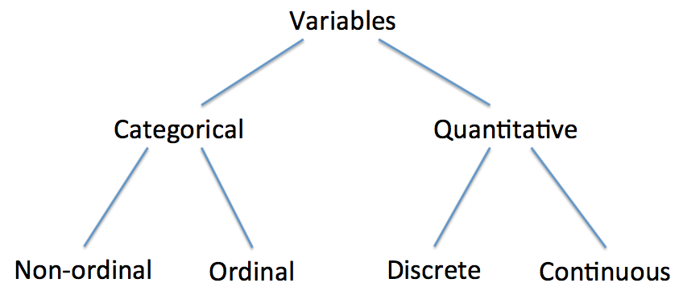
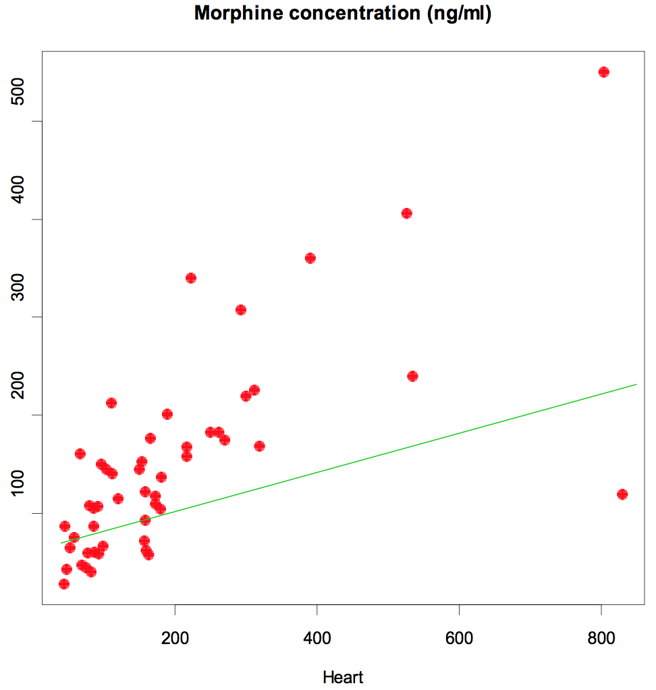
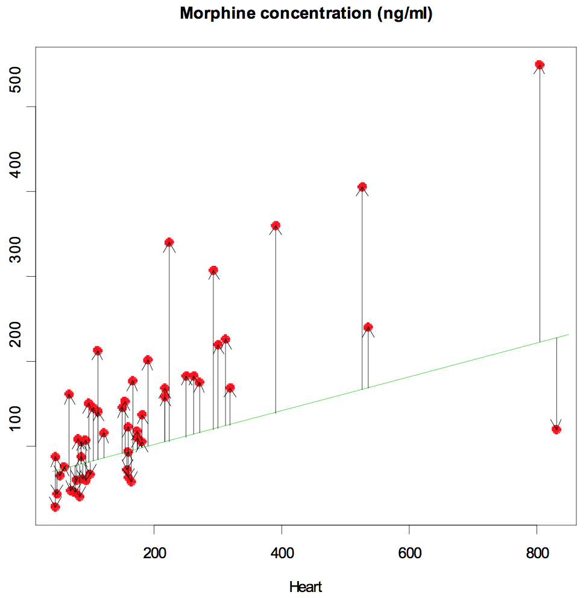

BIOC461
================
A/Prof Mik Black<BR>Department of Biochemistry
30 March 2017

<!-- Run line below in R to render multiple documents: -->
<!-- rmarkdown::render(here::here("bioc461-lec2.Rmd"), output_format='all') -->
<style>
  .col2 {
    columns: 2 200px;         /* number of columns and width in pixels*/
    -webkit-columns: 2 200px; /* chrome, safari */
    -moz-columns: 2 200px;    /* firefox */
  }
  .col3 {
    columns: 3 100px;
    -webkit-columns: 3 100px;
    -moz-columns: 3 100px;
  }
</style>
<style type="text/css">
.table {
    width: 60%;
}
</style>
<!-- this puts \sf in front of every latex equation, to generate -->
<!-- sans-serif text, but I'm not using it here :) -->
<!--
<script type="text/x-mathjax-config">
MathJax.Hub.Register.StartupHook("TeX Jax Ready",function () {
  var TEX = MathJax.InputJax.TeX;
  var PREFILTER = TEX.prefilterMath;
  TEX.Augment({
    prefilterMath: function (math,displaymode,script) {
      return PREFILTER.call(TEX,"\\\sf{"+math+"}",displaymode,script);
    }
  });
});
</script>
-->
Wilcoxon–Mann–Whitney Test (WMW)
--------------------------------

-   t-test works well for two independent samples when the two populations have normal (or near-normal) distributions.
-   Serious problems can occur when the distributions have heavy tails or are skewed.
-   Wilcoxon-Mann-Whitney test does not depend on the assumption of normality.
    -   H**<sub>0</sub>: the two populations have same distribution
    -   H**<sub>*A*</sub>: the two populations have different distributions
-   Calculate a test statistic U**<sub>*s*</sub>.

Example
-------

-   Counting the number of seeds produced by two related species of plant:
    -   Do the number of seeds produced by the two plant species have the same distribution (at *α* = 0.05)?
-   No parameters to define:
    -   H**<sub>0</sub>: the two species have the same distribution of seed number
    -   H**<sub>*A*</sub>: the two species have different distribution of seed number

Example (continued)
-------------------

-   Data should be ordered, if not sort them:

          Species 1:  19, 23, 25, 28, 28, 34  (n1 = 6)
          Species 2:  14, 18, 19, 20, 25      (n2 = 5)

-   Calculate K**<sub>1</sub>: for each observation in sample 1, count the number of observations in sample 2 that are smaller than it; add them up (ties count ½):

    K**<sub>1</sub>= 2 ½ + 4 + 4 ½ + 5 + 5 + 5 = 26

-   K**<sub>2</sub>: for each observation in sample 2, count the number of those in sample 1 that are smaller than it (ties count ½):

    K**<sub>2</sub> = 0 + 0+ ½ + 1 + 2 ½ = 4

Example (continued)
-------------------

-   Test statistic: U**<sub>*s*</sub> = (the larger of K**<sub>1</sub> and K**<sub>2</sub>)=max(K**<sub>1</sub> , K**<sub>2</sub>)=26.
-   U**<sub>*s*</sub> = max(K**<sub>1</sub>, K**<sub>2</sub>) follows the Mann-Whitney null distribution.
-   Test at level *α* = 0.05; critical value is U**<sub>*c**r**i**t**i**c**a**l*</sub> = 27.
    -   U**<sub>*s*</sub> = 26 &lt; 27 = U**<sub>*c**r**i**t**i**c**a**l*</sub> (so P-value &gt; 0.05)
    -   *Do not* reject H**<sub>0</sub>.
-   These data do not provide evidence at the 0.05 significance level that the two plant species have different seed number distributions.

Wilcoxon test in R
------------------

``` r
seeds<-read.csv('DataSets2/seedcounts.csv')
```

``` r
View(seeds)
```

``` r
stripchart(SeedCount ~ Species, data=seeds, pch=16, 
           ylab="Species", ylim=c(0.5,2.5))
```


Wilcoxon test in R
------------------

``` r
wilcox.test(SeedCount ~ Species, data=seeds)
```

    ## Warning in wilcox.test.default(x = c(28L, 23L, 19L, 28L, 25L, 34L), y =
    ## c(19L, : cannot compute exact p-value with ties

    ## 
    ##  Wilcoxon rank sum test with continuity correction
    ## 
    ## data:  SeedCount by Species
    ## W = 26, p-value = 0.05358
    ## alternative hypothesis: true location shift is not equal to 0

Paired Designs
--------------

-   Sometimes observations occur in pairs:
    -   Two observations on the same individual (two days, two sides, before/after...)
    -   observing two groups over time
-   Examples:
    -   subjects occur naturally in pairs, such as identical twins
    -   subjects matched in pairs for similar age, sex, profession, disease status, etc (to match extraneous variables)
    -   same subject measured on two occasions

Paired sample t-test
--------------------

-   A combination of two things we already know - two-sample and one sample t-tests (also Confidence Intervals):

    1.  Recognize that it is a paired design.
    2.  Do hypothesis testing steps like a two independent sample t-test
    3.  Do t calculations like a 1-sample t-test but for differences of measurements.

Example
-------

-   Have 12 fruit flies from 6 different lines (**2 of each**) grown in vials at **two different temperatures**.
-   After a specified time for development, count the number of bristles on each fly.
-   We think that bristle number has approximately a normal distribution, but flies from the same line should have similar bristle numbers.
-   We will look at the **difference** in bristle number **between two flies of the same line**.

Example (continued)
-------------------

-   6 “blocks” (lines).
-   2 treatments = temperature (cold/warm)
-   Have 12 observations but they occur in 6 pairs, so n = 6.

<center>

</center>
-   Does temperature affect the number of bristles on fruit flies?

Example (continued)
-------------------

-   Let 1 and 2 be the mean bristle number for flies grown at the colder and warmer temperatures, respectively:
    -   H**<sub>0</sub>: *μ*<sub>1</sub> = *μ*<sub>2</sub> (i.e., *μ*<sub>1</sub> − *μ*<sub>2</sub> = 0): the mean bristle number is the same for both temperatures
    -   H**<sub>*A*</sub>: *μ*<sub>1</sub> ≠ *μ*<sub>2</sub> (i.e., *μ*<sub>1</sub> − *μ*<sub>2</sub> ≠ 0): the mean bristle number is different at the two temperatures
-   Use a non-directional paired sample t-test.
    -   ts = $\\bar{y}\_{diff} / SE\_{diff}$ has a t-distribution with 6 - 1 = 5 df under H**<sub>0</sub> (df = \#pairs – 1 = 5).
    -   Test at level *α* = 0.05; Critical value is t**<sub>.025</sub>=2.571
-   Will reject H**<sub>0</sub> if t**<sub>*s*</sub> &gt; 2.571 or t**<sub>*s*</sub> &lt; –2.571, otherwise will not reject H**<sub>0</sub>.

Example (continued)
-------------------

-   Do a one-sample t-test using the difference column only:
    -   $\\bar{y}\_{diff}$ = 35 – 36 = –1.5
    -   *S*<sub>*d**i**f**f*</sub> = 1.049
    -   *S**E*<sub>*d**i**f**f*</sub> = $S\_{diff}/\\sqrt{n}$ = 1.049$/\\sqrt{\\sf 6}$ = 0.428
    -   t**<sub>*s*</sub> = –1.5/0.428 = –3.503
    -   –2.571 &lt; t**<sub>*s*</sub> &lt; 2.571, so reject H**<sub>0</sub>.
-   This study provides evidence at the 0.05 significance level that flies have different mean bristle numbers at the two temperatures.

Paired sample t-test in R
-------------------------

``` r
flies<-read.csv('DataSets2/flytemp.csv')
```

``` r
View(flies)
```

``` r
t.test(flies$Cold, flies$Warm, paired=TRUE)
```

    ## 
    ##  Paired t-test
    ## 
    ## data:  flies$Cold and flies$Warm
    ## t = -3.5032, df = 5, p-value = 0.01722
    ## alternative hypothesis: true difference in means is not equal to 0
    ## 95 percent confidence interval:
    ##  -2.6006574 -0.3993426
    ## sample estimates:
    ## mean of the differences 
    ##                    -1.5

Paired tests
------------

-   How to know whether to use paired or unpaired t-test to analyze a given data set?
    -   Easy: Does each data point in one sample naturally correspond to one specific data point in the other sample? If so, use paired t-test.
-   How to know when to use a paired design in your experiment?
    -   Harder: Do you expect the extraneous variables to increase variation and want to match on these variables, or pairing is dictated by the problem (e.g. repeated measurements)?
-   If so use paired design.

Assumptions
-----------

-   Paired-sample t-test is based on the idea that the *differences* are approximately normal, so may want to plot the histogram.
-   This will automatically be true if the individual groups are both normally distributed.

Sign test
---------

-   What if the data are not normally distributed?
    -   Recall: for two independent samples did Wilcoxon-Mann-Whitney.
-   For paired samples we can do the **sign test**.
-   Look at the **sign** of the *difference between each pair of observations*.
-   If the two treatments are the same, the sign is equally likely to be positive as negative. That is, if we take a pair at random (from the population of pairs), whether the first or second of the pair is larger is like flipping a coin.

Sign test
---------

-   Let *π* = probability that, for any pair from the population, the first will be larger.
    -   H**<sub>0</sub>: *π* = 0.5; the two treatments are the same in their effect.
    -   H**<sub>*A*</sub>: *π*≠ 0.5 (this is the non-directional alternative): the two treatments are different in their effect.

1.  For each pair of observations, note whether y**<sub>1</sub>–y**<sub>2</sub> is positive (+) or negative (–), that is, + if y**<sub>1</sub> is bigger, – if y**<sub>2</sub> is bigger
2.  count the number of + (= N**<sub>+</sub>) and – (= N**<sub>–</sub>) (don’t count zeros).
3.  test statistic B**<sub>*s*</sub> = larger of N**<sub>+</sub> and N**<sub>–</sub>.
4.  Reject H**<sub>0</sub> if B**<sub>*s*</sub>≥ critical value.

Example: skin grafts
--------------------

-   Skin grafts applied to *both sides of body* in 11 recipients.
-   One graft has good HLA antigen system match with recipient; the other does not.
-   This is paired because we have two observations from each person.
-   Observe time to rejection of skin graft (not normally distributed so don't use t-test.)

Does a good HLA match increase graft survival time?
---------------------------------------------------

-   Let *π* = probability that good HLA match survives longer in any individual
    -   H**<sub>0</sub>: *π* = 0.5; HLA match and non-match are equally likely to survive longer.
    -   H**<sub>*A*</sub>: *π*&gt; 0.5; HLA match is more likely to survive longer (directional alternative).
-   Use a sign test.
    -   B**<sub>*s*</sub> = N**<sub>+</sub> has a binomial distribution (n=11, *π*= 0.5) under H**<sub>0</sub>. If non-directional, Bs would be max(N+, N–).
-   Test at level *α* = 0.05 ; critical value is 9 (from computer).
-   Will reject H**<sub>0</sub> if B**<sub>*s*</sub>≥ 9; if B**<sub>*s*</sub> &lt; 9 we will not reject.

Example (continued)
-------------------

-   Data: survival times (days)

<center>

</center>
-   n = 11
-   N**<sub>+</sub> = 9, N**<sub>−</sub> = 2; B**<sub>*s*</sub> = N**<sub>+</sub> = 9; B**<sub>0.05</sub> = 9
-   So, reject H**<sub>0</sub>.
-   This study provides evidence (P = 0.033) that a good HLA match survives longer than a poor match.

Sign test in R
--------------

``` r
skin <- read.csv('DataSets2/skingraft.csv')
```

``` r
## Perform Sign Test using binom.test function (1-sided alternative)
## Input the test statistic (Bs=9), and the number of pairs (n=11)
binom.test(9, 11, alternative="greater")
```

    ## 
    ##  Exact binomial test
    ## 
    ## data:  9 and 11
    ## number of successes = 9, number of trials = 11, p-value = 0.03271
    ## alternative hypothesis: true probability of success is greater than 0.5
    ## 95 percent confidence interval:
    ##  0.5299132 1.0000000
    ## sample estimates:
    ## probability of success 
    ##              0.8181818

Types of Variables
------------------

<BR><BR>
<center>

</center>
Types of Variables
------------------

-   Quantitative:
    -   Outcome is a number
    -   height or concentration (continuous)
    -   number of flowers on a plant (discrete)
-   Categorical:
    -   outcomes fall into categories we can list
    -   peas: round & yellow, round & green, wrinkled & yellow, wrinkled & green (not ordinal)
    -   choices on a survey: never, rarely, occasionally, often, always (ordinal)

Categorical data
----------------

-   In order to analyze categorical data we start by counting the number of observations in each category.
-   If there are only two categories,
    -   the number in one category has a binomial distribution (if the observations in the sample are independent).
-   If there are more than two categories,
    -   you can focus on one category and group all the others together; still binomial
    -   or, more often, you define different *π*'s for the different categories (*π*<sub>1</sub>, *π*<sub>2</sub>,...)

Binomial distribution
---------------------

-   *π* is the (unknown) probability of "success", say in category 1.
-   n is the number of observations.
-   Observe y = \# in category 1.
-   The proportion in category 1 is $\\hat{\\pi} = y/n$.
-   y has a binomial (n,*π*) sampling distribution,
-   If n and n(1-*π*) are not too small, this is close to a normal distribution with mean and SD:<BR><BR> $\\mu = n\\pi,\\ \\ \\ \\ \\sigma=\\sqrt{n\\pi(1-\\pi)}$
-   This normal approximation is used both explicitly (for confidence intervals) and implicitly (for testing).

Chi-squared distribution
------------------------

-   To test hypotheses, we will use a distribution called a *χ*<sup>2</sup> distribution (chi-squared).
-   Facts about the *χ*<sup>2</sup> distribution
    -   If you have k random variables *y*<sub>1</sub>, ..., *y*<sub>*k*</sub> , which are all independent and N(0,1), if you square them all and add them up, the resulting sum has a *χ*<sub>*k*</sub><sup>2</sup> distribution. (“a chi-squared distribution with k degrees of freedom”).
    -   *χ*<sup>2</sup> random variables only take on positive values.
-   We have several different tests which all use the 2 distribution to determine critical values, however, the hypotheses are different.

Contingency tables
------------------

-   "2x2” means 2 rows and 2 columns in a table: categorical data with 4 groups that are related in pairs.
-   Two main contexts (sometimes blurred):
    -   Two independent random samples; one binomial variable observed in each sample
    -   One sample; observe two different binomial variables on each sample
-   Examples of context 1:
    1.  samples are "drug" and "placebo" (or any two treatments); observed variable "improve" or "don't improve".
    2.  samples are "male" and "female" (any two groups we set up to compare); observed variable "eye color” brown or blue.

Contingency tables
------------------

-   Examples of context 2:
    -   observe whether people smoke, exercise
    -   observe response to drug for patients in a randomized clinical trial. Four Categories, observations in 2x2 table:<BR><BR>
        <center>
        
        </center>
-   Test for independence of row and column variables.

Association testing: example
----------------------------

<center>

</center>
-   *π*<sub>1</sub> = probability that a patient will improve if they take the drug
-   *π*<sub>2</sub> = probability that a patient will improve if they take the placebo
    -   H**<sub>0</sub>: *π*<sub>1</sub> = *π*<sub>2</sub>
    -   H**<sub>*A*</sub>: *π*<sub>1</sub> ≠ *π*<sub>2</sub> ( or *π*<sub>1</sub> &gt; *π*<sub>2</sub>)
-   H**<sub>0</sub> is that the two probabilities are the same (like *μ*<sub>1</sub> = *μ*<sub>2</sub> in a t-test), which can be phrased in terms of independence.

Example (continued)
-------------------

-   H**<sub>*A*</sub> is that the probabilities are different, which can be phrased in terms of a *lack of independence*, which is called *"association"*:

    -   $\\hat{\\pi}\_1$ = \# who improve with drug / \# who take drug <BR>      = 15/26 = 0.58

    -   $\\hat{\\pi}\_2$ = \# who improve with placebo / \# who take placebo <BR>      = 4/21 = 0.19

Example (continued)
-------------------

-   What values would we expect under H**<sub>0</sub>?
    -   Total who improve is 19 so under H**<sub>0</sub> estimate 19/47 = 40.4% to be the proportion who improve overall.
    -   26 patients took the drug: under H**<sub>0</sub> expect 40.4% of them to improve = (260 × 0.404) = 10.5 = (26 × 19)/47. Similarly, expect number who improve under placebo to be (21 × 19)/47 = 8.5.
    -   For the next row, expect (26 × 28)/47 = 15.5 don't improve with drug and (21 × 28)/47 = 12.5 don't improve with placebo.
-   Can place these "Expecteds" in a table similar to the observed values. Note that the row and column totals are the same as for observed.

Example (continued)
-------------------

<center>

</center>
-   In general, for each category:
    -   E = (row total)(column total)/(grand total)
-   This is the common way to organize the E's and the O's:

<center>

</center>
Example - questions
-------------------

-   Are patients who take the drug more likely to improve than those who take the placebo?

    -   *π*<sub>1</sub> = probability that a patient will improve if they take the real drug
    -   *π*<sub>2</sub> = probability that a patient will improve if they take the placebo

    -   H**<sub>0</sub>: *π*<sub>1</sub> = *π*<sub>2</sub>; the probability of improving is the same whether drug or placebo is taken (outcome and treatment are independent}
    -   H**<sub>*A*</sub>: *π*<sub>1</sub> &gt; *π*<sub>2</sub>; the probability of improving is greater if the drug is taken than if the placebo is taken

-   This example is directional; if non-directional, H**<sub>*A*</sub>: outcome and treatment are not independent.

Example (continued)
-------------------

-   Use a *χ*<sup>2</sup> test of independence
    -   *X*<sub>*s*</sub><sup>2</sup> = ∑(*O* − *E*)<sup>2</sup>/*E* has a *χ*<sub>1</sub><sup>2</sup> distribution under H**<sub>0</sub>.
    -   Test at level *α* = 0.01; reject H**<sub>0</sub> if *X*<sub>*s*</sub><sup>2</sup> &gt; 5.41
-   Since H**<sub>*A*</sub> is directional, must do the following step, but it's a good idea whether directional or not.

    -   $\\hat{\\pi\_1} = \\frac{\\\#\\ who\\ improve\\ with\\ drug} {\\\#\\ who\\ take\\ drug} = \\frac{15}{26} = 0.58$
    -   $\\hat{\\pi\_2} = \\frac{\\\#\\ who\\ improve\\ with\\ placebo} {\\\#\\ who\\ take\\ placebo} = \\frac{4}{21} = 0.19$

-   Check: 0.58 &gt; 0.19, so $\\hat{\\pi\_1}&gt;\\hat{\\pi\_2}$ is in the same direction as H**<sub>*A*</sub>.

Example (continued)
-------------------

-   *X*<sub>*s*</sub><sup>2</sup> = (15-10.5)2/10.5 + (4-8.5)2/8.5 <BR>       + (11-15.5)2/15.5 + (17-12.5)2/12.5 = 7.2
-   Observe 7.2 &gt; 5.41 so reject H**<sub>0</sub>.
-   This study provides evidence at th *α*= 0.01 significance level that the probability of improving is greater if the drug is taken than if the placebo is taken.
-   Degrees of freedom: df = 1 for the 2x2 table.
    -   In general it is (\#rows-1)(\#columns-1)
    -   *X*<sub>*s*</sub><sup>2</sup> has a *χ*<sub>1</sub><sup>2</sup> distribution under H**<sub>0</sub>.

Chi-square test in R
--------------------

``` r
drugs<-read.csv('DataSets2/drugs.csv')
table(drugs$Treatment, drugs$Response)
```

    ##          
    ##           Improve NoImprove
    ##   Drug         15        11
    ##   Placebo       4        17

``` r
chisq.test(table(drugs$Treatment, drugs$Response), correct=FALSE)
```

    ## 
    ##  Pearson's Chi-squared test
    ## 
    ## data:  table(drugs$Treatment, drugs$Response)
    ## X-squared = 7.2037, df = 1, p-value = 0.007275

Chi-square test in R
--------------------

-   Note that we used `correct=FALSE` in the `chisq.test` command: this turns off R's default continuity correction, which is used to improve the *χ*<sup>2</sup> approximation in 2 × 2 tables.

``` r
chisq.test(table(drugs$Treatment, drugs$Response))
```

    ## 
    ##  Pearson's Chi-squared test with Yates' continuity correction
    ## 
    ## data:  table(drugs$Treatment, drugs$Response)
    ## X-squared = 5.6885, df = 1, p-value = 0.01708

What does rejecting H**<sub>0</sub> mean?
-----------------------------------------

-   Sometimes have to be careful about conclusions in this test. If you reject H**<sub>0</sub> with a chi-squared test then that indicates the two variables are **associated**, i.e., not independent; that does not always imply a causal relationship.
-   This study provides evidence that patients who take the drug are more likely to improve than patients who take the placebo.
-   Here we **controlled** the drug vs. placebo and observed the improvement, so it was reasonable to infer causation. If we had performed a test based on observational data, we could only say that the two variables were associated.

Analysis of Variance (ANOVA)
----------------------------

-   How to analyze data when there are k treatments?
    -   Same basic assumptions/limitations as t-test:
    -   Each population has a normal distribution
    -   Samples are independent and random
    -   Want to test hypotheses about the population means *μ*<sub></sub>i
-   SD, *σ*, of each population is the same (or similar) so we can use a pooled SE.
-   Goal: test hypotheses such as
    -   H**<sub>0</sub>: *μ*<sub>1</sub> = *μ*<sub>2</sub> = *μ*<sub>3</sub> = ... = *μ*<sub>*k*</sub>
    -   H**<sub>*A*</sub>: at least one of the *μ*<sub>*i*</sub>'s is different than the others.

ANOVA - The Global F Test
-------------------------

-   H**<sub>0</sub>: *μ*<sub>1</sub> = *μ*<sub>2</sub> = *μ*<sub>3</sub> = ... = *μ*<sub>*k*</sub>
-   H**<sub>*A*</sub>: at least one of the *μ*<sub>*i*</sub>'s is different than the others.
-   To test this hypothesis, we use the test statistic *F*<sub>*s*</sub>, which is the ratio of the "between-group variation"" to the "within-group variation".
-   “Large” values of Fs are “significant,” so reject H**<sub>0</sub> if observed *F*<sub>*s*</sub> &gt; *F*<sub>*c**r**i**t**i**c**a**l*</sub>. Do not reject otherwise.
-   Note: H**<sub>*A*</sub> is non-directional for F-Test, but rejection region is one-tailed.

Example
-------

-   A random sample of 15 healthy young men are split randomly into 3 groups of 5.
-   They receive 0, 20, and 40 mg of the drug Paxil per day for a week, respectively.
-   Then their serotonin levels are measured to determine whether Paxil affects serotonin levels.

Hypotheses
----------

-   Definitions
    -   *μ*<sub>1</sub> is the mean serotonin level for men on 0 mg of Paxil.
    -   *μ*<sub>2</sub> is the mean serotonin level for men on 20 mg of Paxil.
    -   *μ*<sub>3</sub> is the mean serotonin level for men on 40 mg of Paxil.
-   Hypotheses
    -   H**<sub>0</sub>: *μ*<sub>1</sub> = *μ*<sub>1</sub> = *μ*<sub>3</sub> ; mean serotonin levels are the same at all 3 dosage levels (i.e., mean serotonin levels are unaffected by Paxil dose).
    -   H**<sub>*A*</sub>: The mean serotonin levels of the three groups are not all equal (i.e., serotonin levels are affected by Paxil dose).

One-way ANOVA in R
------------------

``` r
paxil<-read.csv('DataSets2/paxil.csv')
View(paxil)
summary(aov(Serotonin ~ as.factor(Dose), data=paxil))
```

    ##                 Df Sum Sq Mean Sq F value  Pr(>F)   
    ## as.factor(Dose)  2  841.9   420.9   8.358 0.00532 **
    ## Residuals       12  604.3    50.4                   
    ## ---
    ## Signif. codes:  0 '***' 0.001 '**' 0.01 '*' 0.05 '.' 0.1 ' ' 1

One-way ANOVA in R
------------------

``` r
## Same result using the `lm` function to fit a linear model:
summary(lm(Serotonin ~ as.factor(Dose), data=paxil))
```

    ## 
    ## Call:
    ## lm(formula = Serotonin ~ as.factor(Dose), data = paxil)
    ## 
    ## Residuals:
    ##     Min      1Q  Median      3Q     Max 
    ## -10.680  -5.240   0.830   5.058  10.840 
    ## 
    ## Coefficients:
    ##                   Estimate Std. Error t value Pr(>|t|)    
    ## (Intercept)         57.602      3.174  18.150 4.32e-10 ***
    ## as.factor(Dose)20   11.678      4.488   2.602  0.02315 *  
    ## as.factor(Dose)40   18.098      4.488   4.032  0.00166 ** 
    ## ---
    ## Signif. codes:  0 '***' 0.001 '**' 0.01 '*' 0.05 '.' 0.1 ' ' 1
    ## 
    ## Residual standard error: 7.097 on 12 degrees of freedom
    ## Multiple R-squared:  0.5821, Adjusted R-squared:  0.5125 
    ## F-statistic: 8.358 on 2 and 12 DF,  p-value: 0.005325

F-test
------

-   *F*<sub>*s*</sub> has an F distribution with df = (2, 12) under H**<sub>0</sub>.
-   Test at significance level  = 0.05.
-   Critical value *F*<sub>.05</sub> = 3.89.
    -   Will reject H**<sub>0</sub> if *F*<sub>*s*</sub> &gt; 3.89, otherwise will not.
    -   Observe *F*<sub>*s*</sub> = 8.358 &gt; *F*<sub>.05</sub>, so reject H0.
-   This study provides evidence that Paxil intake affects serotonin levels in young men.

How/Why does this work?
-----------------------

-   Remember for t-test,
    -   take the difference in means: $\\bar{y}\_1-\\bar{y}\_2$
    -   divide by the amount of sampling variation it has: $SE\_{\\bar{y}\_1-\\bar{y}\_2}$
    -   if $\\bar{y}\_1-\\bar{y}\_2$ is big compared to the amount of variability expected by chance, *t*<sub>*s*</sub> is large; so reject H**<sub>0</sub>.
-   For F-test,
    -   take average squared difference between the group means
    -   divide it by the amount of sampling variation it has
    -   if the between-group variation is large compared to the amount of variability expected by chance, F is large; so reject H0.

Why not just do t-tests on each pair?
-------------------------------------

-   You could, but the probability of making at least one Type I error is bigger than just the  you use for each test because there are possible pairs to test.
-   For example when we test H**<sub>0</sub>: *μ*<sub>1</sub> = *μ*<sub>2</sub> = *μ*<sub>3</sub>, we are actually testing:
    -   H**<sub>01</sub>: *μ*<sub>1</sub> = *μ*<sub>2</sub>
    -   H**<sub>02</sub>: *μ*<sub>1</sub> = *μ*<sub>3</sub>
    -   H**<sub>03</sub>: *μ*<sub>2</sub> = *μ*<sub>3</sub>
-   And we would reject H**<sub>0</sub> if any one of H**<sub>01</sub>, H**<sub>02</sub> or H**<sub>03</sub> would be rejected by a t-test with prob of Type I error = 0.05 on first test, 0.05 on second test, etc.

Why not just do t-tests on each pair?
-------------------------------------

-   The more tests you do, the more likely you are to make at least one mistake. (With k &gt; 7 you would expect to make at least one mistake).
-   Plus, the tests are not independent so it’s not even easy to decide what the true Type I error probability is.
-   Also, ANOVA lets you get at more complicated patterns.
-   So, if you don't reject H**<sub>0</sub>, stop. The data provide no evidence in favor of H**<sub>*A*</sub>.

Post-hoc testing
----------------

-   You can also perform additional tests to determine which means are different:
-   Use the `TukeyHSD` function in R:

``` r
TukeyHSD(aov(Serotonin ~ as.factor(Dose), data=paxil))
```

    ##   Tukey multiple comparisons of means
    ##     95% family-wise confidence level
    ## 
    ## Fit: aov(formula = Serotonin ~ as.factor(Dose), data = paxil)
    ## 
    ## $`as.factor(Dose)`
    ##         diff        lwr      upr     p adj
    ## 20-0  11.678 -0.2961563 23.65216 0.0561323
    ## 40-0  18.098  6.1238437 30.07216 0.0043776
    ## 40-20  6.420 -5.5541563 18.39416 0.3571044

Post-hoc testing
----------------

-   There is a significant difference in mean serotonin levels between men receiving a 0mg dose of Paxil, and those receiving a 40mg dose.

``` r
stripchart(Serotonin ~ as.factor(Dose), data=paxil, pch=16, ylab="Dose")
```


Relationships between quantitative variables
--------------------------------------------

-   Often interested in the relationship between two quantitative variables.
-   Need methods for:
    -   data display
    -   describing the relationship

Relationship between variables
------------------------------

-   As in the contingency table data, this may be
    -   one random sample; observe two quantities
    -   one of the variables may be controlled (e.g. dose)
-   Examples
    -   X = concentration, Y = rate of reaction
    -   X = dose, Y = response
    -   X = weight, Y = height
    -   X = root extension, Y = carbon allocation
    -   X = midterm 1 score, Y = midterm 2 score
-   If the experimenter controls one of the variables, that is usually labeled X, and the "response” is Y.

Heroin again
------------

-   For each cadaver blood taken from heart and from peripheral organs.
-   Questions of interest:
    -   What is the relationship between the two concentrations?
    -   Can we use the heart concentration to predict the peripheral concentration?

Load heroin data
----------------

``` r
heroin <- read.csv('DataSets2/heroin-regression.csv')
head(heroin)
View(heroin)
```

    ##   Heart Periphery
    ## 1    67       161
    ## 2   110       213
    ## 3    45        87
    ## 4    96       150
    ## 5    80       108
    ## 6   103       145

Scatterplot
-----------

``` r
plot(heroin$Heart, heroin$Periphery, 
     main="Morphine concentration (ng/ml)")
```


“Line of best fit”
------------------

Fit any line: how good is it?



“Line of best fit”
------------------

Calculate the distance from each point to the line, square them, and add them all up.



“Line of best fit”
------------------

-   *Peripheral conc. = 65 + 0.43 Heart conc.*


-   Line of best fit minimizes these “sums of squared errors”.

Linear Regression
-----------------

-   A way to look at the relationship between continuous variables
-   Back to quantitative data with assumed normal distributions
-   Conceptually related to both ANOVA and contingency tables
-   “Finding a straight line" through the data
-   Data: pairs of observations (X, Y), so observe:
    -   (x**<sub>1</sub>, y**<sub>1</sub>), (x**<sub>2</sub>, y**<sub>2</sub>),..., (x**<sub>*n*</sub>, y**<sub>*n*</sub>)

What does "best" mean?
----------------------

-   For each observed value of x there is a value of y predicted by the straight line, which we write as

<center>
$\\hat{y} = b\_0 + b\_1 x$
</center>
-   This is usually not exactly the same as the observed y for that x.
-   Compare the actual vs. predicted y; difference is called residual:
-   Residual = *y* - $\\hat{y}$ (one for each pair of observations, i.e., n residuals)

Regression in R
---------------

``` r
summary(lm(Heart ~ Periphery, data=heroin))
```

    ## 
    ## Call:
    ## lm(formula = Heart ~ Periphery, data = heroin)
    ## 
    ## Residuals:
    ##     Min      1Q  Median      3Q     Max 
    ## -196.95  -54.70   -5.40   25.11  668.61 
    ## 
    ## Coefficients:
    ##             Estimate Std. Error t value Pr(>|t|)    
    ## (Intercept)  20.3604    30.3705   0.670    0.506    
    ## Periphery     1.1753     0.1699   6.916  9.9e-09 ***
    ## ---
    ## Signif. codes:  0 '***' 0.001 '**' 0.01 '*' 0.05 '.' 0.1 ' ' 1
    ## 
    ## Residual standard error: 121.4 on 48 degrees of freedom
    ## Multiple R-squared:  0.4991, Adjusted R-squared:  0.4887 
    ## F-statistic: 47.83 on 1 and 48 DF,  p-value: 9.897e-09

Regression output
-----------------

-   Coefficients are the intercept and slope of the regression line.
-   Significance of the slope means that there is a linear relationship between the variables.

``` r
summary(lm(Heart ~ Periphery, data=heroin))$coefficients
```

    ##              Estimate Std. Error   t value     Pr(>|t|)
    ## (Intercept) 20.360409 30.3705099 0.6704006 5.058153e-01
    ## Periphery    1.175255  0.1699363 6.9158543 9.896584e-09

Aside - log transformation
--------------------------

-   The relationship between the Heart and Periphery variables is more linear when each variable is log transformed.

``` r
plot(log(heroin$Heart), log(heroin$Periphery), pch=20, cex=0.8,
     main="Morphine concentration (ng/ml)")
```


Correlation Coefficient
-----------------------

-   The correlation coefficient, *ρ*, measures the strength of linear association between two normally distributed variables.
-   r = $\\hat{\\rho}$ has the same sign as the slope of the regression model.
-   It is always between -1 and +1 and r has no units.
-   It will be 1 only if the data points are exactly on a straight line so that all the residuals are 0.
-   It will be 0 when there is no linear relationship between X and Y.
-   A value "close" to 1 indicates a "tight" linear relationship between X and Y.

Correlation
-----------

-   If r is large in magnitude (close to 1) we say X and Y are highly "correlated".
    -   "Negatively correlated" when r is negative,
    -   “Positively correlated" when r is positive.
-   If r = 0 there is no linear relationship; we say X and Y are "uncorrelated" (Note: uncorrelated is not the same thing as independent!)
-   The word "uncorrelated" is also used to describe data with small but nonzero values of r.

Testing H**<sub>0</sub>: *ρ* = 0
--------------------------------

-   Test H**<sub>0</sub> the same way (questions, distributions, conclusions) as above:
    -   Is there a linear relationship between Y and X?
-   Let *ρ* be the correlation coefficient between X and Y for the population.
    -   H**<sub>0</sub>: *ρ* = 0 There is no linear relationship between Y and X.
    -   H**<sub>*A*</sub>: *ρ* ≠ 0 There is a linear relationship between Y and X. (or H**<sub>*A*</sub> could be directional, e.g., H**<sub>*A*</sub>: *ρ* &gt; 0).

Correlation in R
----------------

-   Default is “Pearson”: for normally distributed variables

``` r
cor(heroin$Heart, heroin$Periphery)
```

    ## [1] 0.7064758

-   “Spearman” is a rank-based approach (doesn’t require normality).

``` r
cor(heroin$Heart, heroin$Periphery, method='spearman')
```

    ## [1] 0.7625885

Test for significance
---------------------

``` r
cor.test(heroin$Heart, heroin$Periphery)
```

    ## 
    ##  Pearson's product-moment correlation
    ## 
    ## data:  heroin$Heart and heroin$Periphery
    ## t = 6.9159, df = 48, p-value = 9.897e-09
    ## alternative hypothesis: true correlation is not equal to 0
    ## 95 percent confidence interval:
    ##  0.5329257 0.8229865
    ## sample estimates:
    ##       cor 
    ## 0.7064758

Assignment: R Markdown
----------------------

-   RStudio provides a framework for producing documents within R: R Markdown
-   R Markdown uses a simple syntax to produce documents containing:
    -   comments
    -   code
    -   output
-   By deafult, running an R Markdown (.Rmd) file will produce HTML output, although other output formats can be used.
-   See the website below for more details, and click the "Get Started" link to get a video overview.

<http://rmarkdown.rstudio.com/>

Creating an R Markdown document
-------------------------------

-   In RStudio, select the 'New File' then 'R Markdown...' from the 'File' menu.
-   Choose 'Document' and give it a name (leave the output format as "HTML"), then click 'OK'.
-   This creates a basic R Markdown document conating some sample code:
    -   the top of the file contains some basic information
    -   blocks of R code have \`\`\`{r} in front, and \`\`\` after: these are run when you click "Knit" (see next slide), and the output appears in the HTML file
    -   everything else in the file is treated as text to be displayed

Creating an R Markdown document
-------------------------------

-   Various text effects can be achieved using markdown syntax (e.g., "\#\#" for headings): see the link below for (many) more options.
-   Clicking the "Knit" button in RStudio (above your code window) will run the code, and open a built-in browser that displays the processed document as rendered HTML.
-   This file is saved in a folder within your working directory, and can be opened in any web browser, exported to other formats etc.
-   A big advantage of R Mardown is *reproducibility* - anyone with the .Rmd file and associated data can *exactly* reproduce the results in the document.

<http://rmarkdown.rstudio.com/authoring_basics.html>
